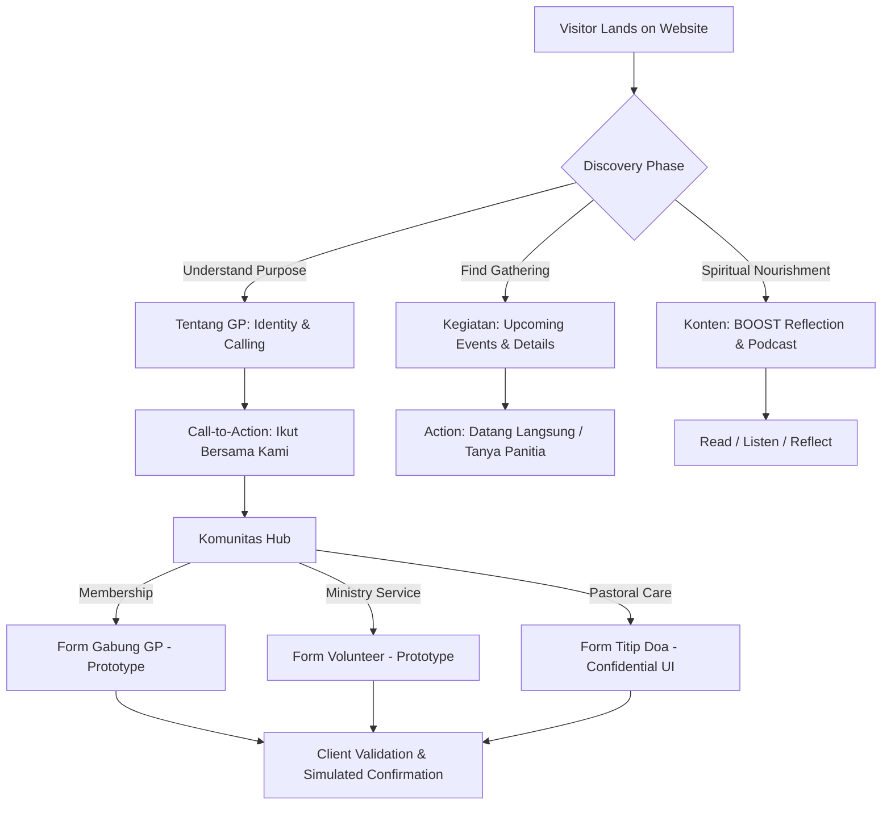

# GP GPIB Jatipon Bekasi — Phase 1: Product & UX Specification (V1) [REVISED]

**Document Status:** Approved Revision (Phase 1 Specification Review)  
**Target Release:** Website V1 (Public Static MVP / Demo-Ready Digital Home)  
**Author:** Lead Product Strategist, UX Architect & Content Strategist  
**Target Audience:** GP Stakeholders, Engineering Team, Quality & Security Auditors  

---

## Change Log (Phase 1 Revision Review)

| Section | Nature of Revision | Description & Justification |
| :--- | :--- | :--- |
| **Global** | Claim Hardening | Removed unverified claims of "official verification" across all organizational and ministerial content. |
| **Section 1.3 & 7.3** | Privacy De-escalation | Replaced misleading absolute claims ("100% confidential", "zero-leak", "encrypted") with realistic UX privacy intent statements and identified open technical/governance questions. |
| **Section 6 & 7** | Form Reclassification | Explicitly reclassified all V1 forms as **UI Prototypes with Client-Side Validation & Simulated Submission**, acknowledging that no production backend/dispatch pipeline currently exists. |
| **Section 8** | Content Audit | Replaced binary "VERIFIED" classifications with granular, honest labels: `SOURCE-BACKED`, `WORKING ASSUMPTION`, `PLACEHOLDER`, and `REQUIRES CONFIRMATION`. |
| **Section 11** | Scope Realignment | Refined P0 to represent the absolute minimum demo-ready static MVP. Moved calendar sync, social share APIs, and lightbox modals to P1. |
| **Section 12** | Acceptance Criteria | Rewrote criteria to be objectively testable and measurable, specifying exact automated or manual verification procedures. |
| **Section 13** | Risk Register (New) | Added a comprehensive risk register covering content accuracy, form privacy, third-party embeds, placeholder data, SPA SEO, and stakeholder dependencies. |

---

## 1. Product Goal & Measurable UX Objectives

### 1.1 Project Vision
Transform the GP GPIB Jatipon Bekasi web presence into a **warm, intentional, and demo-ready digital home**. The experience guides young people through the natural communal journey:
$$\text{Discover} \longrightarrow \text{Connect} \longrightarrow \text{Participate} \longrightarrow \text{Grow} \longrightarrow \text{Archive}$$

### 1.2 Core Product Goal
Deliver an accessible, mobile-first, static Single-Page Application (SPA) that allows visitors to immediately comprehend who Gerakan Pemuda (GP) GPIB Jatipon is, explore upcoming activities and spiritual reflections, and experience intuitive pathways for joining, volunteering, or submitting prayer requests—without requiring user accounts or logins.

### 1.3 Measurable UX Objectives
1. **10-Second Value Comprehension:** A first-time visitor landing on the homepage must be able to visually identify the organization (Gerakan Pemuda GPIB Jatipon Bekasi), its pastoral nature, and primary call-to-action within 10 seconds of scanning the above-the-fold viewport.
2. **2-Click Discoverability:** Any active event or featured spiritual reflection (BOOST/Podcast) must be reachable within $\le 2$ click/tap interactions from the root route.
3. **Form Simplicity:** Each form (Join, Volunteer, Titip Doa) must contain $\le 5$ primary input fields, designed for mobile completion in $\le 60$ seconds.
4. **Transparent Privacy Messaging:** Forms handling personal or pastoral information must clearly communicate the scope of data handling and avoid making unsubstantiated cryptographic guarantees.
5. **Mobile-First Responsiveness:**
   - Interactive touch targets must meet a minimum dimension of $44 \times 44\text{ px}$.
   - Content must render without horizontal overflow down to a viewport width of $360\text{ px}$.
   - Color contrast between foreground text and backgrounds must achieve WCAG 2.2 AA standards ($\ge 4.5:1$ for normal text, $\ge 3:1$ for large text).

---

## 2. User Personas

| Persona | Archetype & Mindset | Primary Goals & JTBD | Frustrations & Risks | Key Touchpoints |
| :--- | :--- | :--- | :--- | :--- |
| **1. First-Time Visitor** *(e.g., Jonathan, 19)* | College student or newcomer in Jatibening/Bekasi exploring church options. | "I want to know what this youth community is about and whether newcomers are welcome before I visit." | Overly bureaucratic church jargon, hidden schedules, intimidated by high commitment asks. | Home Hero, Tentang GP, Kegiatan (Upcoming). |
| **2. Prospective GP Member** *(e.g., Sarah, 22)* | Young adult seeking spiritual fellowship and community connection. | "I want an easy way to introduce myself to the youth leaders and register my interest in joining." | Complicated registration barriers, broken forms, unanswered Instagram DMs. | Komunitas (`/komunitas/join`), Kegiatan Detail, Contact. |
| **3. Active GP Member** *(e.g., Kevin, 25)* | Regular participant in GP Jatipon services and activities. | "I want to quickly check the date/location of upcoming events and read today's BOOST reflection." | Difficult navigation, unreadable text on mobile screens, outdated calendars. | Konten Hub (`/konten`), BOOST Reader, Kegiatan. |
| **4. Service Volunteer** *(e.g., Michelle, 21)* | Youth interested in serving through music, multimedia, or social action. | "I want to explore open ministry areas where I can contribute my skills." | Lack of clarity on ministry divisions or who to contact to offer help. | Komunitas (`/komunitas/volunteer`), Activities. |
| **5. Pastoral / Prayer Seeker** *(e.g., Anonim, 20)* | Carrying personal or spiritual burdens; seeking pastoral prayer support. | "I want to share a private prayer concern without exposing my identity or personal struggles publicly." | Fear of public exposure, mandatory contact fields, misleading security claims. | Komunitas (`/komunitas/titip-doa`). |

---

## 3. Core User Journeys



### Journey 1: Discover GP (First-Time Visitor)
1. **Entry:** Lands on `/` via QR code, shared link, or web search.
2. **First Impression:** Scans hero headline and categorical badge identifying GP GPIB Jatipon.
3. **Exploration:** Views nearest upcoming event card and featured reflection snippet.
4. **Action:** Clicks "Tentang GP" to understand identity or "Lihat Kegiatan" to see gathering details.

### Journey 2: Understand GP's Identity (First-Time / Prospective Member)
1. **Entry:** Navigates to `/tentang-gp`.
2. **Review:** Reads about the age bracket (17–35), GPIB categorical structure, and the 3 core pillars (*Spiritualitas, Persaudaraan, Aksi Nyata*).
3. **Next Step:** Encounters bottom invitation card leading to `/komunitas/join`.

### Journey 3: Discover Activities & Events (All Personas)
1. **Entry:** Navigates to `/kegiatan`.
2. **Scanning:** Reviews upcoming scheduled events vs. past activities.
3. **Inspection:** Clicks an event to open `/kegiatan/:slug` to see time, location, theme, and description.
4. **Follow-through:** Reads event instructions (e.g. venue address, dress code, open invite).

### Journey 4: Explore Spiritual Content (Active Member / Seeker)
1. **Entry:** Navigates to `/konten`.
2. **Filter:** Selects category chip (All, BOOST, Podcast, Articles).
3. **Consumption:** Reads BOOST devotional in focused reader layout, or accesses podcast episode audio player.

### Journey 5: Connect & Register Interest (Prospective Member / Volunteer)
1. **Entry:** Arrives at `/komunitas/join` or `/komunitas/volunteer`.
2. **Interaction:** Fills out concise contact and interest details.
3. **Feedback:** Instant inline validation verifies correct phone format.
4. **Simulated Completion:** Submits form; UI triggers loading state and renders simulated confirmation screen with clear follow-up expectations.

### Journey 6: Submit Prayer Request (Prayer Seeker)
1. **Entry:** Navigates to `/komunitas/titip-doa`.
2. **Privacy Assessment:** Sees honest privacy statement explaining that requests are handled with pastoral care and are never published publicly.
3. **Input:** Inputs optional name (or leaves blank for anonymity) and prayer topic.
4. **Submission:** Submits form and receives warm pastoral acknowledgement.

---

## 4. Refined Sitemap & Navigation Architecture

### 4.1 Sitemap Tree

```
/ (Home)
├── /tentang-gp (Tentang GP: Identitas & Pilar Pelayanan)
├── /kegiatan (Agenda & Kegiatan)
│   └── /kegiatan/:slug (Detail Kegiatan)
├── /konten (Ruang Bertumbuh: Hub Konten)
│   ├── /konten/boost (Kategori: BOOST Devotional)
│   ├── /konten/podcast (Kategori: Podcast)
│   ├── /konten/articles (Kategori: Artikel)
│   └── /konten/:slug (Detail / Reader View Konten)
├── /komunitas (Pusat Komunitas)
│   ├── /komunitas/join (Formulir Anggota Baru - Prototype)
│   ├── /komunitas/volunteer (Pendaftaran Relawan - Prototype)
│   └── /komunitas/titip-doa (Ruang Titip Doa - Prototype)
├── /arsip (Arsip Perjalanan)
│   └── /arsip/:slug (Detail Album Dokumentasi)
├── /contact (Informasi Kontak Gereja)
└── /404 (Halaman Tidak Ditemukan)
```

### 4.2 Navigation UX Decisions
- **Desktop Navigation:** Five clear primary links (`Tentang GP`, `Kegiatan`, `Konten`, `Komunitas`, `Arsip`) plus prominent CTA button `Ikut Bersama Kami`. `Contact` is linked in the global footer to prevent navigation clutter.
- **Mobile Navigation:** Responsive drawer overlay with high-contrast close action ($48\text{ px}$ target) containing all primary links and contact information.
- **Content Route Separation:** Clarified technical routing to ensure category filters (`boost`, `podcast`, `articles`) do not collide with content slugs.

---

## 5. Information Architecture (IA) per Primary Page

### 5.1 Home (`/`)
- **Hero Section:** Clear title, badge, and value proposition explaining GP GPIB Jatipon; primary CTAs (`Ikut Bersama Kami` and `Lihat Kegiatan`).
- **Upcoming Activity Strip:** Highlights nearest upcoming activity; renders clean fallback when no events are scheduled.
- **Featured Content Spotlight:** Teaser cards for latest BOOST reflection and Podcast episode.
- **Community Pathways:** Distinct visual cards directing to Join GP, Volunteer, and Titip Doa.
- **Global Footer:** Church affiliation, address note, contact placeholders, copyright.

### 5.2 Tentang GP (`/tentang-gp`)
- **Identity Overview:** Categorical youth ministry within GPIB Jemaat Jatipon Bekasi (ages 17–35).
- **Working Ministerial Pillars:** Explaining Spiritualitas, Persaudaraan, and Aksi Nyata as thematic areas.
- **Ministry Team Roster:** Transparent placeholder grid indicating that leadership details will be populated upon official confirmation.

### 5.3 Kegiatan (`/kegiatan` & `/kegiatan/:slug`)
- **Listing View:** Chronological presentation of upcoming events vs. past activities with date, time, and venue tags.
- **Detail View:** Event hero, date/time badge, venue description, theme/agenda details, and back-link to listing.

### 5.4 Konten (`/konten` & `/konten/:slug`)
- **Hub Listing:** Filter chips (All, BOOST, Podcast, Articles) and responsive grid of content cards.
- **Reader / Player Views:** Dedicated reading layout for written reflections; embedded media player layout for podcast episodes.

### 5.5 Komunitas (`/komunitas` & Sub-pages)
- **Hub Page:** Card-based navigation into the three community action channels.
- **Sub-pages:** Dedicated form interfaces for Join GP, Volunteer, and Titip Doa (see Section 7).

### 5.6 Arsip (`/arsip` & `/arsip/:slug`)
- **Listing View:** Yearly/thematic retrospective album cards.
- **Detail View:** Album summary and responsive photo gallery grid.

### 5.7 Contact (`/contact`)
- **Church Information:** Church name, address block, contact information, service times.
- **Map Block:** Visual location frame / embedded map.
- **Inquiry Form:** General communication form prototype.

---

## 6. Form Classification & Engineering State

To prevent misrepresenting the capabilities of the V1 static implementation, every form is explicitly classified across engineering levels:

| Form Name | Route | UI Prototype | Client-Side Validation | Submission Pipeline | Production-Ready Backend | V1 Status |
| :--- | :--- | :---: | :---: | :---: | :---: | :--- |
| **Gabung GP** | `/komunitas/join` | Yes | Yes (Format & Required) | None (Simulated) | No (Deferred V2) | **Client Prototype with Simulated State** |
| **Volunteer** | `/komunitas/volunteer` | Yes | Yes (Format & Required) | None (Simulated) | No (Deferred V2) | **Client Prototype with Simulated State** |
| **Titip Doa** | `/komunitas/titip-doa` | Yes | Yes (Length & Required) | None (Simulated) | No (Deferred V2) | **Client Prototype with Simulated State** |
| **Contact Message** | `/contact` | Yes | Yes (Format & Required) | None (Simulated) | No (Deferred V2) | **Client Prototype with Simulated State** |

> [!IMPORTANT]
> **V1 Form Reality:**  
> In the V1 static application, form submissions **do not transmit data across an external network or write to a database**. When a user submits a form:
> 1. Inputs are validated in the browser.
> 2. A temporary simulated submission delay occurs ($1\text{–}1.5\text{s}$).
> 3. The interface transitions into a success confirmation state.
> 4. **No data is persisted in browser storage, logged to the browser console, or sent to third-party endpoints.**

---

## 7. Form UX & Privacy Specification

### 7.1 Form 1: Gabung GP (`/komunitas/join`)
- **Purpose:** Onboarding prospective youth members into GP Jatipon.
- **Engineering State:** Client Prototype with Simulated Submission.
- **Fields:**
  1. `Nama Lengkap` *(text, required, min 2 chars)*
  2. `Usia` *(number / select 17–35, required)*
  3. `No. WhatsApp` *(tel, required, indonesian phone regex format)*
  4. `Sektor / Wilayah Domisili` *(text, optional)*
  5. `Persetujuan Kontak` *(checkbox, required)*: *"Saya bersedia dihubungi oleh pengurus GP Jatipon untuk koordinasi kegiatan."*
- **UX Feedback:**
  - Inline error text on invalid input.
  - Submit button shows loading spinner.
  - Replaces form with welcoming confirmation text explaining simulated status during prototype testing.

### 7.2 Form 2: Volunteer (`/komunitas/volunteer`)
- **Purpose:** Gathering expressions of interest for ministry service.
- **Engineering State:** Client Prototype with Simulated Submission.
- **Fields:**
  1. `Nama Lengkap` *(text, required)*
  2. `No. WhatsApp` *(tel, required)*
  3. `Bidang Minat Pelayanan` *(multi-select chips/checkboxes, required)*:
     - Musik & Vokal
     - Multimedia & Kreatif
     - Liturgi & Acara
     - Logistik & Aksi Sosial
  4. `Catatan Singkat` *(textarea, optional)*
- **UX Feedback:** Loading state followed by appreciative confirmation screen.

### 7.3 Form 3: Titip Doa (`/komunitas/titip-doa`) — De-escalated Privacy Specification

#### Distinction Between UX Intent & Technical Reality
- **UX Privacy Intent:** The interface communicates pastoral respect: prayer topics are treated as personal matters intended solely for prayer support and will not be displayed on public boards.
- **Technical Reality:** The V1 static frontend does not transmit or store this text anywhere. It is an interactive client-side prototype.

#### UI Privacy Copy (Revised)
> **🔒 Ruang Doa Pribadi**  
> *"Pokok doa ini dibuat untuk keperluan pelayanan doa GP GPIB Jatipon dan tidak akan ditampilkan pada halaman publik website ini. Anda dipersilakan menggunakan nama inisial atau mengirimkan secara anonim."*

#### Form Fields
1. `Nama` *(text, optional)*: Placeholder: *"Nama atau inisial (kosongkan jika ingin anonim)"*.
2. `Kategori Doa` *(select, optional)*: Pergumulan Pribadi, Keluarga, Pekerjaan/Studi, Pemulihan Kesehatan, Ucapan Syukur.
3. `Pokok Doa` *(textarea, required, min 10 characters)*: Placeholder: *"Tuliskan pokok doa Anda di sini..."*.
4. `Honeypot Anti-Spam` *(hidden input, tabIndex=-1, auto-complete off)*.

#### Governance Questions for Stakeholder Confirmation
Before connecting this form to an actual submission pipeline (e.g. Formspree/EmailJS or backend API), the following governance questions must be answered:
1. **Recipient:** Exactly which authorized pastoral role (e.g., Pendeta Jemaat, Ketua GP, Koordinator Bidang Teologi) will receive prayer submissions?
2. **Transmission & Storage:** What transport layer will be used? Where will prayer text be stored (e.g., secure mailbox vs. no storage)?
3. **Retention Policy:** How long will submissions be retained before deletion?
4. **Access Control:** Who has access to the destination inbox?
5. **Deletion Rights:** How can a user request immediate deletion of their submitted prayer?

---

## 8. Content Verification Matrix (Audited)

All content elements across the website are classified under strict criteria:

| Content Element | Classification | Source / Basis | Action Required |
| :--- | :--- | :--- | :--- |
| **GP Age Demographics (17–35)** | **SOURCE-BACKED** | Tata Gereja GPIB / Peraturan Pelayanan Kategorial Gerakan Pemuda. | Retain as standard GPIB kategorial rule. |
| **GPIB Jemaat Jatipon Affiliation** | **SOURCE-BACKED** | Official church denomination context. | Retain in header and footer. |
| **Motto "Menjangkau, Merangkul, Melayani"** | **WORKING ASSUMPTION** | Widely used youth theme in scaffold. | Require GP BPH confirmation before formal production freeze. |
| **Core Pillars (Spiritualitas, Persaudaraan, Aksi Nyata)** | **WORKING ASSUMPTION** | Standard ministerial framework modeled in scaffold. | Require GP committee alignment. |
| **Church Physical Address** | **PLACEHOLDER** | Rough location in Jatibening, Bekasi without verified RT/RW/No. | Obtain verified address from Secretariat. |
| **Secretariat WhatsApp & Email** | **PLACEHOLDER** | Dummy phone (`+62 812...`) and generic email. | Obtain official authorized contact person. |
| **Regular Service Cadence / Times** | **PLACEHOLDER** | Fictional event dates in mock data. | Obtain official youth service schedule. |
| **Leadership / Committee Names** | **REQUIRES CONFIRMATION** | Undocumented in repository. | Keep masked with explicit placeholder labels until authorized. |
| **Benhur Blue Hex Value (`#2563EB`)** | **WORKING TOKEN** | Standard Tailwind Royal Blue used as visual proxy. | Verify official GP Pantone / RGB brand guidelines. |
| **BOOST Devotionals & Articles** | **TEMPORARY PLACEHOLDER** | Sample devotional text created for layout verification. | Replace with genuine youth devotionals in Phase 7. |
| **Podcast Embed / Spotify Link** | **TEMPORARY PLACEHOLDER** | Mock embed URL in data. | Obtain genuine Spotify show link or disable embed. |
| **Archive Event Photos** | **TEMPORARY PLACEHOLDER** | Placeholder icons / generic photo containers. | Obtain authorized past event photos in Phase 7. |

---

## 9. States, Mobile UX & Responsive Behaviors

### 9.1 Application States
- **Empty States:**
  - *No Upcoming Activities:* "Belum ada agenda terdekat saat ini. Tetap pantau pengumuman kami atau hubungi pengurus untuk informasi kegiatan mendatang." Renders link to Contact page.
  - *No Content in Category:* "Belum ada konten dalam kategori ini. Silakan jelajahi kategori lainnya."
  - *No Archive Photos:* "Dokumentasi album ini sedang dihimpun."
- **Loading States:**
  - Card skeleton placeholders with muted pulse animation (`bg-surface/50 animate-pulse`).
  - Interactive buttons transition to disabled state with loading spinner during form actions.
- **Error States:**
  - 404 Route: Distinct screen displaying *"Halaman Tidak Ditemukan"* with a clear button returning to `/`.
  - Form Input Errors: Specific inline validation messages rendered adjacent to the erroneous input with accessible high-contrast text.

### 9.2 Mobile UX Details
- Target screen widths down to $360\text{ px}$ without horizontal scrollbars.
- Minimum touch target size of $44 \times 44\text{ px}$ for all buttons and interactive anchors.
- Horizontal category chips in `/konten` use touch-friendly scrolling with no hidden elements.

---

## 10. Accessibility (A11y) & SEO Requirements

### 10.1 Accessibility Requirements
1. **WCAG 2.2 AA Color Contrast:**
   - Primary text (`#F8FAFC`) on dark navy background (`#020617`): Contrast ratio $> 16:1$.
   - Muted text (`#94A3B8`) on dark navy background: Contrast ratio $\approx 7:1$.
   - Interactive accent buttons (`#2563EB` with white text): Contrast ratio $> 4.5:1$.
2. **Keyboard Navigability:**
   - All interactive elements must show a distinct, visible focus ring (`focus-visible:ring-2 focus-visible:ring-accent`).
   - Logical tab flow through all navigation links and form controls.
3. **Semantic Hierarchy:**
   - Exactly one `<h1>` per page view.
   - All form inputs explicitly linked to `<label>` tags via matching `id` and `htmlFor` attributes.
   - Screen-reader accessible hidden text (`sr-only`) provided for icon-only buttons.

### 10.2 SEO & Social Sharing
- **Title Tags:** Format `[Page Title] | GP GPIB Jatipon Bekasi`.
- **Meta Descriptions:** Descriptive meta description tag per primary page.
- **Open Graph Protocol:** Standard `og:title`, `og:description`, and `og:type` tags in `index.html`.
- **SPA Awareness:** Acknowledge that client-side SPA routing has indexing constraints on search engines that do not execute JavaScript; keep critical structural metadata in static `index.html`.

---

## 11. Prioritized Feature List (V1 vs Future Roadmap)

### 🔴 P0: Minimum Demo-Ready MVP (Current V1 Scope Freeze)
- [x] Responsive dark navy / Benhur Blue visual theme.
- [x] Home page with 10-second value proposition, upcoming event banner, content spotlights, and community cards.
- [x] Tentang GP page with GPIB youth identity, 3 working pillars, and clearly marked leadership placeholder.
- [x] Kegiatan listing (upcoming vs. past) and Activity Detail view.
- [x] Konten hub with category filtering (All, BOOST, Podcast, Articles) and reader/player views.
- [x] Komunitas hub and 3 form UI prototypes (Join, Volunteer, Titip Doa) with client-side validation and simulated completion states.
- [x] Arsip listing and Album Detail gallery view.
- [x] Contact page with church details, map frame, and inquiry form prototype.
- [x] TypeScript mock data layer cleanly separated from presentation components.
- [x] Mobile drawer navigation and responsive layouts ($360\text{ px}$ to $1440\text{ px}$).

### 🟡 P1: Value-Add Enhancements (Implement only if time permits in Phase 7)
- [ ] Web Share API integration on BOOST reflections and Activity pages.
- [ ] Direct WhatsApp click-to-chat link for immediate secretariat contact.
- [ ] Quick keyword filter / search bar in Content Hub.
- [ ] Modal lightbox viewer for Archive photo galleries.
- [ ] Integration of lightweight submission transport (e.g. Formspree/EmailJS) if authorized.

### 🟢 P2: Deferred Scope (Strictly V2 / V3)
- [ ] ❌ Backend database & REST/GraphQL API.
- [ ] ❌ Member authentication, account profiles, and login flows.
- [ ] ❌ Administrative Content Management System (CMS).
- [ ] ❌ Attendance tracking and QR code check-in.
- [ ] ❌ Online payment / tithing processing.

---

## 12. Acceptance Criteria & Verification Matrix

Every primary page must satisfy objective, testable acceptance criteria verified by explicit commands or procedures:

| Page / Area | Acceptance Criteria | Verification Method |
| :--- | :--- | :--- |
| **Global Application** | Project compiles with zero TypeScript errors and zero linter warnings. | Run `npm run build` (`tsc -b && vite build`) and `npm run lint` (`oxlint`). |
| **Global Application** | Layout renders without horizontal clipping or scrollbars at $360\text{ px}$, $768\text{ px}$, and $1280\text{ px}$ viewports. | Responsive viewport audit in browser subagent / devtools. |
| **Global Navigation** | Desktop navbar renders all 5 primary links; mobile hamburger menu toggles drawer open/closed with keyboard and touch. | Manual / subagent interaction test. |
| **Home (`/`)** | Hero displays organization name and both CTA buttons; clicking `Ikut Bersama Kami` navigates to `/komunitas/join`. | Navigation routing test in browser. |
| **Home (`/`)** | Upcoming activity strip renders nearest event from data, or displays empty state text when array is empty. | Data state manipulation test. |
| **Tentang GP (`/tentang-gp`)** | Displays 3 pillars and leadership placeholder grid labeled clearly with unverified/placeholder notice. | Visual inspection in browser. |
| **Kegiatan (`/kegiatan`)** | Upcoming activities display formatted Indonesian dates and location badges; clicking card navigates to `/kegiatan/:slug`. | Routing and date formatting test. |
| **Kegiatan Detail (`/kegiatan/:slug`)** | Renders event details, theme description, and functioning back button returning to `/kegiatan`. | Route transition test. |
| **Konten Hub (`/konten`)** | Clicking category chips filters displayed cards to match selected category without full-page reload. | Filter state interaction test. |
| **Konten Detail (`/konten/:slug`)** | BOOST items render reader layout; Podcast items render audio player embed; back button returns to `/konten`. | Component layout verification. |
| **Forms (`/komunitas/*`)** | Empty required fields trigger visible client validation on submit; invalid phone format is flagged. | Form validation test. |
| **Forms (`/komunitas/*`)** | Submitting valid inputs triggers loading state and transitions into confirmation view without console errors. | Form submit simulation test; check devtools console. |
| **Titip Doa (`/komunitas/titip-doa`)** | Explicitly displays privacy statement; does not require mandatory full name; honeypot input is hidden from tab order. | DOM inspection; accessibility audit. |
| **Arsip (`/arsip`)** | Displays archive album cards; clicking card routes to `/arsip/:slug`. | Navigation test. |
| **Contact (`/contact`)** | Displays church info block and inquiry form with functioning client validation. | Form interaction test. |

---

## 13. Risk Register

| Risk ID | Category | Risk Description | Impact | Likelihood | Mitigation Strategy in V1 |
| :---: | :--- | :--- | :---: | :---: | :--- |
| **R-01** | Content | Unverified church schedules or contacts could mislead visitors. | High | Med | Label all unverified schedules and phone numbers with explicit `[PLACEHOLDER]` tags until confirmed by stakeholders. |
| **R-02** | Privacy | Users might assume Titip Doa is backed by an encrypted server, creating false expectations. | High | Med | De-escalate all claims; clearly state in UI copy that this is a pastoral form for prayer support, not a cryptographic vault. |
| **R-03** | Third-Party | Third-party embeds (Spotify iframe, Google Maps) could degrade performance or fail to load. | Med | Med | Provide graceful fallback placeholders and lazy-load all iframes. |
| **R-04** | Data Loss | Users submit real prayer requests or join requests expecting immediate follow-up on a prototype. | High | Low | In demo mode, clearly display notice that submissions are simulated until official launch. |
| **R-05** | SEO | Static client-side SPA routing may have limited indexing on legacy search crawlers. | Low | High | Maintain semantic HTML structure and descriptive metadata in static `index.html`. |
| **R-06** | Stakeholder | Delays in receiving official brand guidelines (Benhur Blue Pantone) and leadership approval. | Med | High | Use working tokens (`#2563EB`) cleanly isolated in CSS variables for rapid one-line global updating. |

---

## 14. Updated Open Questions Requiring Stakeholder Confirmation

The following decisions remain open and require explicit stakeholder resolution before Phase 7 (Content Integration):

1. **Brand Identity:** Is `#2563EB` acceptable as the working token for GP Benhur Blue, or is there an official Pantone/CMYK/Hex code specified by GPIB?
2. **Official Contact Information:** What are the authorized church phone number, secretariat WhatsApp, and official email address?
3. **Form Submission Pipeline:** When transitioning from prototype to production, what is the preferred lightweight recipient mechanism for Join GP and Volunteer submissions (e.g., direct WhatsApp link vs. Formspree/EmailJS to a designated inbox)?
4. **Prayer Request Recipient:** Who is the designated pastoral caretaker or prayer team lead authorized to receive Titip Doa submissions?
5. **Leadership Roster:** Does the current Pengurus Komisi GP authorize publishing their names and positions on the public website for V1?
6. **Podcast & Media Feeds:** Is there an active Spotify podcast feed or YouTube channel link to embed, or should the podcast section be configured in an empty/coming-soon state for V1?

---

*Phase 1 Revision Review Complete. All claims audited and grounded. Awaiting explicit authorization to commence Phase 2 (Technical Architecture).*
